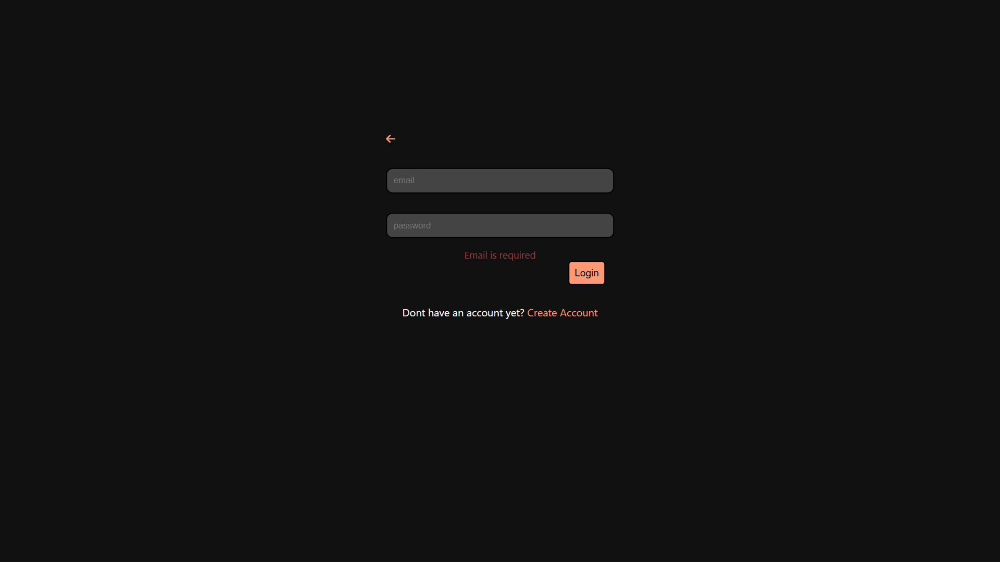
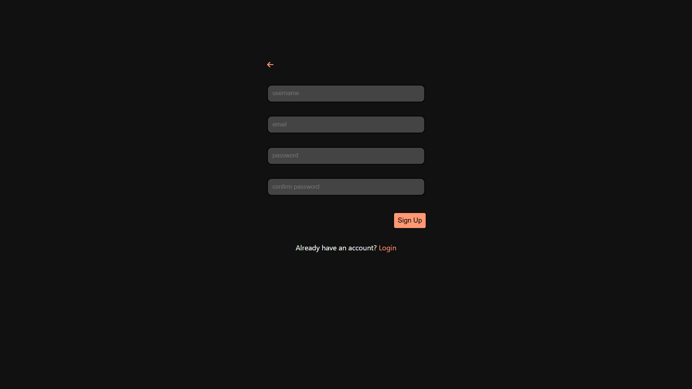
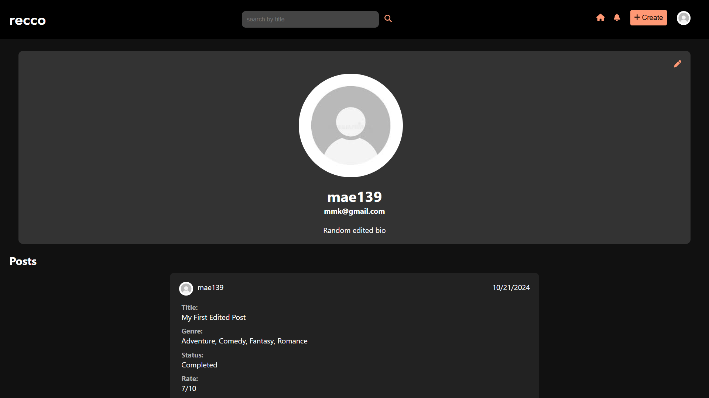
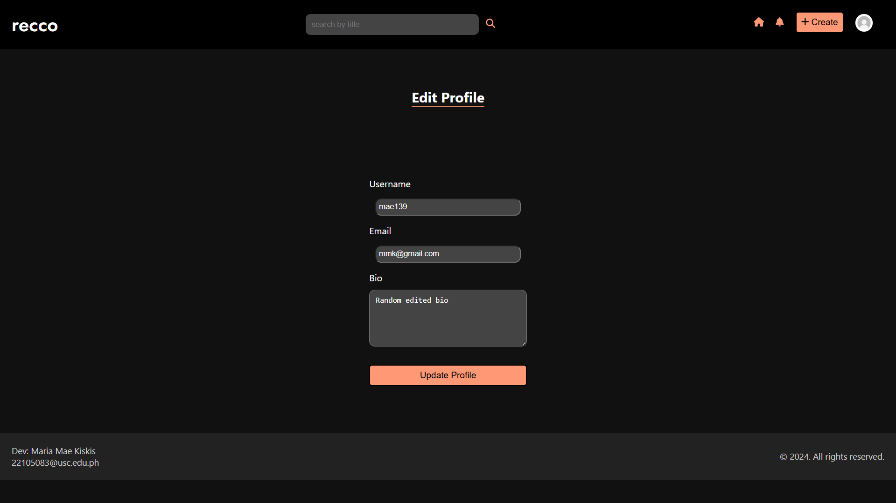
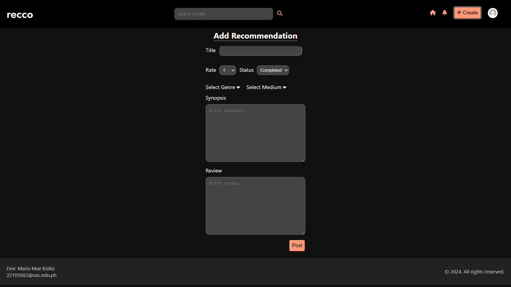
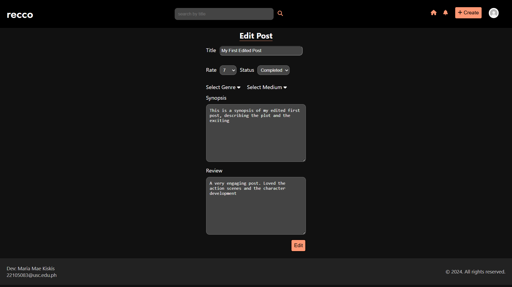
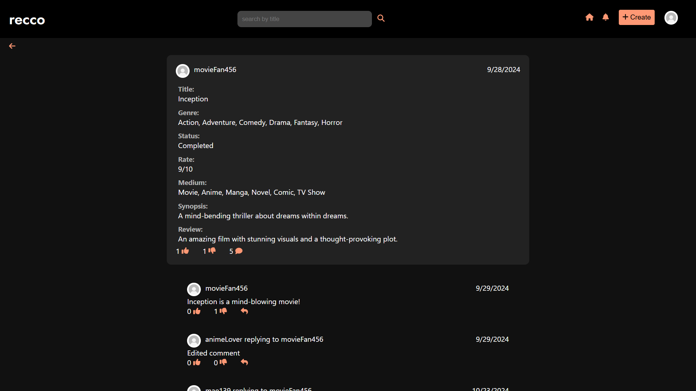
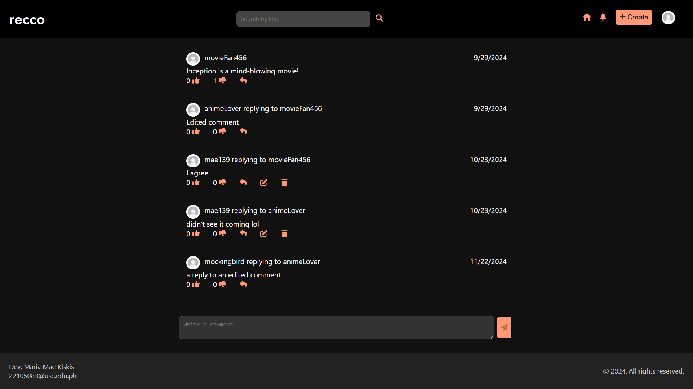
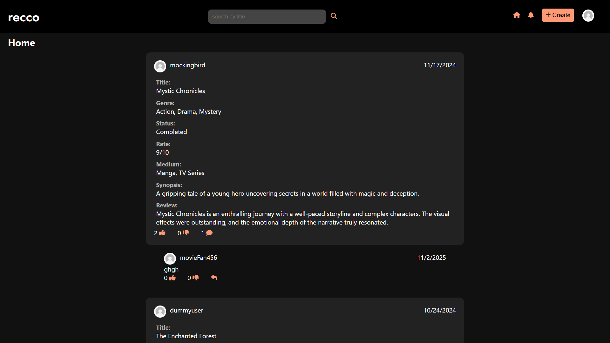
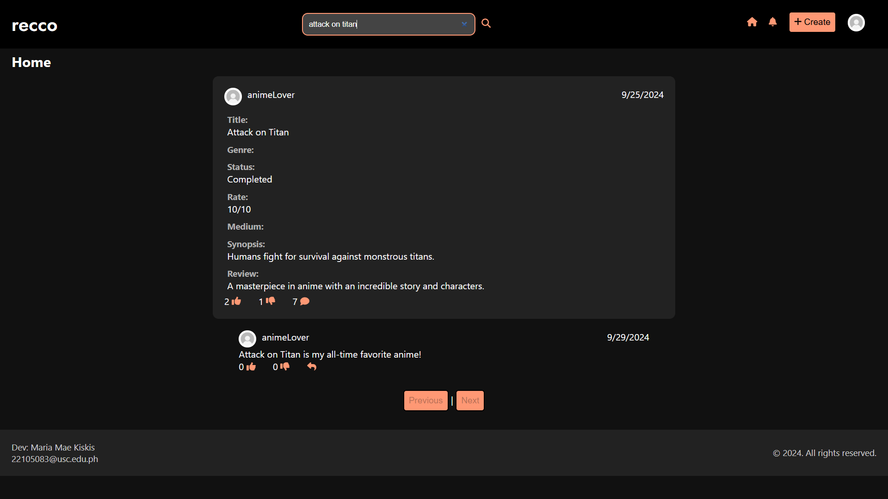

# Recco

Recco is a social media platform designed for users to share and recommend their favorite shows across a variety of mediums and genres. The platform enables users to discover new content, connect with others who share similar interests, and engage in meaningful discussions about their favorite entertainment.

## Screenshots

## Features

### User Authentication & Profile Management
- Secure user registration and login system
- JWT-based authentication
- Customizable user profiles with bio and avatar
- Profile editing capabilities
- Protected routes for authenticated users

<table>
  <tr>
    <td></td>
    <td></td>
  </tr>
</table>
<table>
  <tr>
    <td></td>
    <td></td>
  </tr>
</table>

### Content Management
- Create and share detailed show recommendations
- Include show titles, synopses, and personal reviews
- Rate shows with a custom rating system
- Update or delete your own posts
- Rich text content support for reviews

<table>
  <tr>
    <td></td>
    <td></td>
  </tr>
</table>

### Social Interaction
- Comment on posts
- Reply on comments
- React like or dislike on comments and posts
- Update and delete your own comments
- View other users' profiles
- Interactive user interface with real-time feedback

<table>
  <tr>
    <td></td>
    <td></td>
  </tr>
</table>

### Search & Discovery
- Search functionality to find specific shows or reviews
- Browse all posts in a clean, organized feed
- Filter and sort content options
- Mobile-responsive design for all devices

<table>
  <tr>
    <td></td>
    <td></td>
  </tr>
</table>

### User Interface
- Dark theme for comfortable viewing
- Responsive header with user menu
- Clean and intuitive navigation
- Error handling and user feedback
- Loading states and animations

### Security Features
- Protected API endpoints
- Input validation and sanitization
- Secure password handling
- Protected user data access
- Session management

## Technologies Used

**Frontend:**
- **React**: A JavaScript library for building user interfaces.
- **Zustand**: A small, fast state management solution for React.
- **Formik**: A library for managing form state and validation.
- **Yup**: A schema builder for value parsing and validation.
- **js-cookie**: A simple, lightweight JavaScript API for handling cookies.

**Backend:**
- **Node.js**: A JavaScript runtime built on Chrome's V8 JavaScript engine.
- **Prisma ORM**: An open-source database toolkit for TypeScript and Node.js.
- **Joi**: A powerful schema description language and data validator for JavaScript.
- **cookie-parser**: Middleware to parse cookies in HTTP requests.
- **CORS**: Middleware for enabling Cross-Origin Resource Sharing.
- **dotenv**: A zero-dependency module that loads environment variables from a `.env` file into `process.env`.
- **JWT (JSON Web Tokens)**: A compact, URL-safe means of representing claims to be transferred between two parties.

**Database:**
- **MySQL**: An open-source relational database management system.

## Getting Started

1. Clone the repository
2. Import the existing database from the `database` folder
3. Install dependencies:
   ```bash
   npm install        # Install frontend dependencies
   cd server
   npm install        # Install backend dependencies
   ```
4. Set up your environment variables
5. Start the development servers:
   ```bash
   npm run dev        # Start frontend
   cd server
   npm run dev        # Start backend
   ```

## Note
Import existing database located in the database folder before starting the application.
